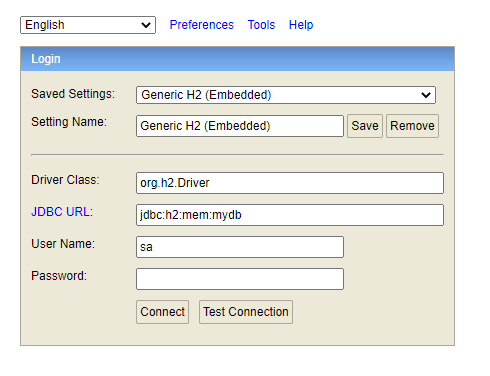

# Documentación de prueba CRUD

## Compilación de proyecto

Dentro del proyecto ejecutar el siguiente comando:

```shell
mvn clean install
```

## Ejecución del programa:

Idenficamos la ubicación del jar generado, y ejecutamos el siguiente comando:

```shell
java -jar crud-proof-1.0.0.jar
```

## Configuración del puerto del proyecto

En archivo `application.properties` existe el siguiente valor

```properties
server.port=8081
```

Si está en uso ese puerto donde se vaya a ejecutar, sólo es necesario cambiar ese valor por el deseado

## Colección de peticiones (Proyecto Postman)

En la raíz del proyecto existe un archivo `json`, el cual podemos impactar para probar nuestros endpoints:

```
CRUD Proof.postman_collection.json
```

## Acceso a la base de datos del proyecto (H2)

Abrimos cualquier navegador y abrimos la siguiente url:

```url
http://localhost:8081/proof/h2-console
```

La conexión quedaría de esta manera:



## Acceso a la documentación de la API

Abriendo el navegado, podemos verificar la documentación de las API, accediendo a la siguiente url:

```url
http://localhost:8081/proof/swagger-ui.html
```